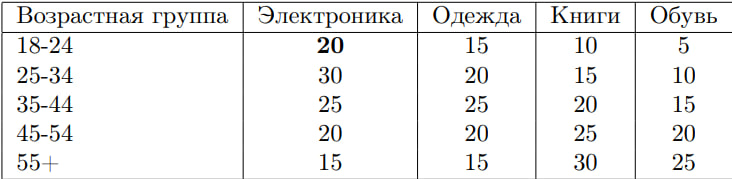

# Задание 4

## Описание задачи

Вам предоставляется матрица, где строки обозначают события \( A \), а столбцы — значения \( B \). На пересечении строки и столбца указано количество способов реализации пар \( AB \). Задача состоит в том, чтобы вычислить:

1. **Количество информации** между событиями \( A \) и \( B \).  
2. **Энтропию совместного распределения** для этих событий.

## Пример входной матрицы

Пример входных данных представлен в таблице ниже:



В данной матрице:

- Строки представляют множество \( X \) — возрастные группы.  
- Столбцы соответствуют множеству \( Y \) — категории товаров.  
- Значения на пересечении показывают, сколько единиц товара определенной категории было приобретено определенной возрастной группой.

## Пример выходных данных

Программа должна вывести рассчитанные показатели в консоль. Для указанной выше матрицы примерный результат, округленный до двух знаков после запятой, выглядит следующим образом:

```
Количество информации I(X,Y): 0.05
Энтропия совместного события H(XY): 4.23 (для обоих способов расчета)
```
